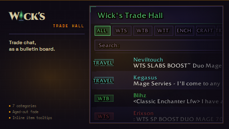

<p align="center"></p>

# Wick's Trade Hall

> Trade channel, as a bulletin board. Seven categories, aged-out listings, no wall-of-spam.

Part of the **[Wick suite](https://github.com/Wicksmods/WickSuite)**: seven precision addons built around a single fel-green-on-deep-purple aesthetic.

<!-- wick:suite-table:start -->
| Addon | GitHub | CurseForge |
|---|---|---|
| **Wick's TBC BIS Tracker** | [repo](https://github.com/Wicksmods/WickidsTBCBISTracker) | [CurseForge](https://www.curseforge.com/wow/addons/wicks-tbc-bis-tracker) |
| **Wick's CD Tracker** | [repo](https://github.com/Wicksmods/WicksCDTracker) | [CurseForge](https://www.curseforge.com/wow/addons/wicks-cd-tracker) |
| **Wick's Trade Hall** | [repo](https://github.com/Wicksmods/WicksTradeHall) | [CurseForge](https://www.curseforge.com/wow/addons/trade-hall) |
| **Wick's Macro Builder** | [repo](https://github.com/Wicksmods/WicksMacroBuilder) | [CurseForge](https://www.curseforge.com/wow/addons/wicks-macro-builder) |
| **Wick's Combat Log** | [repo](https://github.com/Wicksmods/WicksCombatLog) | [CurseForge](https://www.curseforge.com/wow/addons/wicks-combat-log) |
| **Wick's Stats** | [repo](https://github.com/Wicksmods/WicksStats) | [CurseForge](https://www.curseforge.com/wow/addons/wicks-stats) |
| **Wick's Quest Key** | [repo](https://github.com/Wicksmods/WicksQuestKey) | [CurseForge](https://www.curseforge.com/wow/addons/wicks-quest-key) |
| **Wick's Layers** | [repo](https://github.com/Wicksmods/WicksLayers) | [CurseForge](https://www.curseforge.com/wow/addons/wicks-layers) |
| **Wick's Totems and Things** | [repo](https://github.com/Wicksmods/WicksTotemsAndThings) | [CurseForge](https://www.curseforge.com/wow/addons/wicks-totems-and-things) |
<!-- wick:suite-table:end -->

## Features

- **Reads Trade channel** and classifies every message into one of seven categories: **WTS · WTB · WTT · ENCHANT · CRAFT · TRAVEL · MISC**.
- **Bulletin board layout** — each listing is a row, newest on top.
- **Age fade** — listings shift white → yellow → grey as they get stale.
- **Filter by category** with one click, or All for the firehose.
- **Inline item-link tooltips** parsed out of raw messages.
- **Minimap button** — left-click toggle, right-click options.
- **Expiry window configurable** in options.

## Install

- **CurseForge:** [curseforge.com/wow/addons/trade-hall](https://www.curseforge.com/wow/addons/trade-hall)
- **Manual:** drop the `WicksTradeHall` folder into `World of Warcraft\_classic_\Interface\AddOns\`.

## Usage

```
/wth
```

Toggles the Trade Hall. Options cog for filter thresholds, expiry window, and category visibility.

## Compatibility

- **TBC Classic** (Burning Crusade / Anniversary) — Interface `20505`.
- Works wherever you have `/2` Trade joined (major cities).

## Brand

Uses the locked Wick palette and 10px/2px fel-green L-bracket chrome. See:
- `UI.lua` — tokens at top of file
- `CHANGELOG.md` — version history
- `logo.svg` — logomark source

## License

See `LICENSE`.
